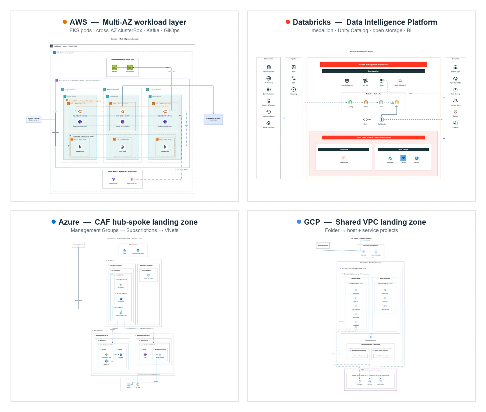

<p align="center">
  
  &nbsp;&nbsp;
  
</p>

<p align="center">
  
  
  
  
  
  <a href="LICENSE"></a>
  <a href="CONTRIBUTING.md"></a>
</p>

An orchestration and validation framework enabling AI agents to generate **structurally precise and aesthetically standardized** draw.io diagrams, optimized for AWS, Azure & GCP architectures.

It mitigates common AI agent hallucinations (such as generating non-existent stencil IDs that result in empty shapes) using three key components:

1. **Declarative Catalog** — A single source of truth mapping draw.io stencil IDs (`mxgraph.aws4.*`) to their respective taxonomies and canonical color palettes.
2. **Design Principles** — Codified architectural and layout rules (`skills/drawio/references/principles.md`).
3. **Structural Validator** — A static analysis engine that audits diagram XML to guarantee stencil references are valid and design principles are satisfied prior to serialization.

Exposed to the AI via the **self-contained `drawio-ai` CLI** (one bundled file, nothing extra to install).

## Showcase

One diagram per platform — all generated end-to-end by the kit: no hand-placed coordinates, real stencils, validated, vision-checked. Full set in [`examples/`](examples/).

<p align="center"></p>

## Quick start

**Requirements:** Node.js ≥20.6 **or** Bun 1.4+. Nothing else to install.

> **Bun-only machine (no `node`)?** The CLI's shebang is `#!/usr/bin/env node` (the Windows-safe standard), so `install.sh` writes `~/.local/bin/drawio-ai` as a wrapper that runs `bun <pkg>/dist/cli.mjs`. Re-run `install.sh` after `bun update -g`. With a manual `bun add -g`, run `bun $(bun pm bin -g)/../install/global/node_modules/drawio-ai-kit/dist/cli.mjs` or install Node.

### 1. One-liner (CLI + skill)

```bash
curl -fsSL https://raw.githubusercontent.com/sparklabx/drawio-ai-kit/refs/heads/v2/install.sh | sh
```

It installs `drawio-ai-kit@latest` globally with Bun (if present) or npm, links the `drawio-ai` command into
`~/.local/bin` (pick another dir with `BIN_DIR=/dir` or `--bin-dir /dir`; pin a version with `--version 3.0.0`), then registers the `drawio` skill with every
agent it finds. It never installs a runtime and needs no `sudo`. Prefer to read it first? Download
`install.sh`, open it, then run `sh install.sh` (`--dry-run` prints the commands only; `--help` lists options).

Re-run it to upgrade. It first removes old installs so exactly one copy remains:
- any global copy from npm or Bun, including old git installs
- the old skills (`drawio-aws`, `drawio-cloud-architect`, …) and their leftover folders
- the pre-1.0 MCP entry

Pass `--no-clean` to keep them.

### 2. Manual (npm or Bun)

```bash
npm i -g drawio-ai-kit && drawio-ai skill install      # npm
bun add -g drawio-ai-kit && drawio-ai skill install    # Bun
```

About 2 MB from the npm registry, so it takes seconds. `drawio-ai skill install` registers the skill straight
from the installed package, with no second download. Restart your agent, then try: *"draw an AWS 3-tier web app"*.

### 3. As a project dependency (scripts and types)

```bash
npm i drawio-ai-kit        # or: bun add drawio-ai-kit
```

```js
import { Diagram, group, icon, renderTree } from "drawio-ai-kit";   // full TypeScript types included
```

Run such a script with plain `node build.mjs` or `bun build.mjs`. Without a local install, use the global CLI:
`drawio-ai run build.mjs` (it resolves `"drawio-ai-kit"` to the installed CLI).

The global install puts the `drawio-ai` binary on PATH (see [INSTALL.md](INSTALL.md) to pin a version).
Install only from the npm registry; installing from git or GitHub is not supported. The CLI ships as a **Bun-minified production bundle** (`dist/`)
that runs on Node or Bun. Its one library (icon search) is bundled inside, so users install nothing extra.
The skill step uses the `skills` CLI, which auto-detects Claude Code, Codex, Gemini CLI, … —
without it the agent never picks the kit up on its own.

One skill covers every domain: it asks you what's missing (which cloud? what to draw?), then
loads just that domain's reference. It is written in short, explicit steps so small fast models
(e.g. Claude Haiku) can drive it end-to-end.

- Optional, for the full experience: the **draw.io desktop app** enables `drawio-ai render` (the vision self-check); **Graphviz** enables `vendor/autolayout.py` for large graphs. Details in [INSTALL.md](INSTALL.md).

## Is it safe to install?

Short answer: yes — and you don't have to take my word for it.

- **No hidden code.** No `postinstall` (or any lifecycle) hooks — nothing runs on `npm install`. No dependencies are installed alongside it. **No `sudo`, no runtime installs, no remote code at run time.** The optional one-line installer is a short POSIX script you can read first. The shipped `dist/` is minified, but it is a reproducible build of the readable `src/`: it is never committed; CI builds it on every PR (and checks the build is deterministic), and the release job builds the published copy from the tagged source.
- **Self-contained.** The package has no runtime `dependencies`. The one library it uses (`minisearch`, for icon search) is a devDependency that Bun bundles into `dist/`, and `npm audit --omit=dev` runs in CI.
- **Runs locally, no telemetry.** The CLI only reads/writes local files. The single optional outbound call is icon-logo fetching from public CDNs (lobe-icons), and it's opt-in.
- **Easy to undo:**

```bash
npm uninstall -g drawio-ai-kit              # remove the CLI (Bun: bun remove -g drawio-ai-kit)
npx skills remove drawio                  # remove the skill (Bun: bunx skills remove drawio)
```

- **Updating** — two independent channels:

```bash
npm i -g drawio-ai-kit@latest && drawio-ai skill install   # CLI + skill (Bun: bun add -g drawio-ai-kit@latest)
```

The skill drives `drawio-ai` at runtime, so engine fixes reach you the moment you update the
CLI. Re-running `drawio-ai skill install` refreshes the skill's docs from the same version. Pin a release with
`drawio-ai-kit@2.0.0`.

To report a security issue, see [`SECURITY.md`](SECURITY.md).

## Build a diagram — declarative, no hardcoded coordinates

Define a diagram **topology** (`pipeline`/`hierarchy`/`network`/`hubspoke`/`hybrid`/`mesh`/`sequence`), declare the **nested structure**, and the layout engine programmatically computes spatial coordinates (x/y/w/h) — frames auto-size to fit their children, while rows and columns auto-space. You define the logical topology, not raw pixels.

```js
import { Diagram, group, icon, box, renderTree } from "drawio-ai-kit";   // run: drawio-ai run build.mjs (or plain node/bun where drawio-ai-kit is installed)

const d = new Diagram("network");
const tree = group("region", "group_region", "Region", { dir: "row" }, [
  group("vpc", "group_vpc", "VPC", { dir: "col" }, [
    icon("alb", "elastic_load_balancing", "ALB"),
    icon("ec2", "ec2", "EC2"),
  ]),
]);
renderTree(d, tree);                 // engine lays everything out + sizes the page
d.title("My VPC");
d.link("alb", "ec2");                // edges by id; router picks straight/corridor
const res = d.validate();            // names real? colors/nesting/labels clean?
// d.mxfile("My VPC")  → write to .drawio, export PNG, then vision self-check
```

Icon names are retrieved from `drawio-ai search` to prevent name fabrication (it tolerates typos, aliases like `k8s`/`pg`/`es`, and multi-keyword queries); edge routing, container sizing, alignment, and contextual corner styles are dynamically computed. The AI agent defines the logical layout and iterates via a render-analyze-rectify loop (vision-based self-correction). Example: `examples/aws/build_mesh.mjs` (zero manual coordinates).

## Migration (from 1.x)

At **2.0.0** the 5 domain skills (`drawio-aws`, `drawio-azure`, `drawio-gcp`, `drawio-databricks`,
`drawio-bpmn`) were merged into ONE `drawio` skill, and the CLI became a Bun-minified bundle in `dist/`.

- **Easiest:** re-run `install.sh`. It removes the old skills and the old CLI, then installs fresh.
- **Skills (manual):** `npx skills remove drawio-aws drawio-azure drawio-gcp drawio-databricks drawio-bpmn`, then `drawio-ai skill install`.
- **CLI (manual):** `npm i -g drawio-ai-kit` (from the npm registry; the bin points at `dist/cli.mjs`).
- **Your build scripts:** import everything from `"drawio-ai-kit"` (the package no longer ships `src/`). Re-scaffold, or replace the `<ROOT>/src/builder.ts` / `layout-engine.ts` / `bpmn.ts` imports with that one name. Run with `drawio-ai run build.mjs`.
- `drawio-ai principles --mode …` and `drawio-ai workflow` still work; they now print the skill's `references/` and `workflows/build.md`.

## Migration (from <1.0)

At **1.0.0** the MCP server and bespoke installer were removed. To migrate:

- **Install:** run `install.sh`. It removes the `drawio-ai-kit` MCP entry and the old
  `drawio-cloud-architect` / `drawio-aws-architect` skill folders, then installs the CLI from npm and the `drawio` skill.
- **Manual:** `claude mcp remove drawio-ai-kit --scope user`, delete the old skill folders
  (e.g. `~/.agents/skills/drawio-cloud-architect`), then `npm i -g drawio-ai-kit && drawio-ai skill install`.
- **Vision self-check:** the inline image was replaced by `drawio-ai render` → PNG → `Read`.
- **Uninstall:** `npm uninstall -g drawio-ai-kit` + remove each skill via the skills tooling.

## Template library (`examples/`)

Each file builds one common architecture via the layout engine (zero hardcoded coordinates) — copy one as a starting point. Examples are **organized into domain subfolders** — see [`examples/README.md`](examples/README.md) for the full index. Copy one out of the kit and run it: `drawio-ai scaffold <file> -o <dir>/build.mjs --name <name>.drawio && drawio-ai run <dir>/build.mjs` (the `.drawio` lands next to the script; never run examples inside the kit folder).

**`examples/aws/`**

| Example | Type | Architecture |
| --- | --- | --- |
| `build_pipeline.mjs` | pipeline | Layered data analytics pipeline (ingest → process → store → serve) + cross-cutting band |
| `build_landingzone.mjs` | hierarchy | AWS Landing Zone / Control Tower org & OUs |
| `build_vpc.mjs` | network | VPC Multi-AZ 3-tier (ALB spanning AZs) |
| `build_vpc_routing.mjs` | network | Subnets + route tables + VPC Endpoint (Gateway) → S3 |
| `build_vpc_eks.mjs` | network | VPC with Bastion, NAT, EKS, Auto Scaling worker nodes |
| `build_vpc_efs.mjs` | network | VPC with Amazon EFS (a mount target per AZ) |
| `build_web3tier.mjs` | network | 3-tier web app (Edge → Web → App → Data) |
| `build_eventdriven.mjs` | hubspoke | Serverless event bus (EventBridge hub → consumers) |
| `build_serverless.mjs` | sequence | Serverless web app, numbered request walkthrough |
| `build_hybrid.mjs` | hybrid | On-prem ↔ AWS over Direct Connect + VPN, mirrored DR |
| `build_mesh.mjs` | mesh | Multi-account connectivity / service mesh |
| `build_iam_accounts.mjs` | hierarchy | Multi-account IAM + cross-account assume-role |

**`examples/azure/` · `gcp/` · `databricks/` · `multicloud/` · `bpmn/`**

| Example | Type | Architecture |
| --- | --- | --- |
| `azure/build_azure_vnet.mjs` | network | Azure N-tier: Subscription → Resource Group → VNet → Subnet tiers |
| `azure/build_azure_hub_spoke_lz.mjs` | network | CAF hub-spoke landing zone (Management Groups, hub + spoke VNets, reserved subnets, peering, private endpoints) |
| `gcp/build_gcp_vpc.mjs` | network | GCP global VPC across two regions (Project → global VPC → regional Subnets) |
| `gcp/build_gcp_shared_vpc_landing_zone.mjs` | network | Shared VPC landing zone (host/service projects, regional Cloud Router/NAT, Interconnect, PSC, VPC-SC) |
| `databricks/build_lakehouse.mjs` | pipeline | Databricks lakehouse medallion (Bronze/Silver/Gold) + Unity Catalog |
| `databricks/build_platform.mjs` | hybrid | Databricks control-plane vs data-plane deployment topology |
| `databricks/build_data_intelligence_platform.mjs` | pipeline | Databricks Data Intelligence Platform reference (signature bands, medallion, foundation) |
| `databricks/build_mlops.mjs` | pipeline | Databricks MLOps — Git provider + Dev/Staging/Prod workspaces + Unity Catalog + Lakehouse |
| `multicloud/build_multicloud.mjs` | hybrid | On-prem + AWS + Azure composed through a neutral interconnect |
| `bpmn/build_bpmn.mjs` | bpmn | BPMN swimlane process (pool → lanes × phases) |

## Runtime architecture
- **Node ≥20.6 or Bun** — runs the shipped `dist/` bundle (CLI, validator, library). The source in `src/` is TypeScript (`.nvmrc` = 22 for development).
- **Bun 1.4+** — maintainers only: `bun test` runs the suites, `bun run build` bundles `src/` (and devDependencies such as minisearch) into the minified `dist/` that ships. Users need Node or Bun, not both.
- **Python 3.11** (`.python-version`) — data ingestion and compilation pipeline: catalog generator + icon-pack builder (`scripts/build_pack.py`, stdlib only).

Install the dependencies:

```bash
nvm install --lts && nvm use --lts    # or: brew install node
brew install python@3.11              # then: python3.11 --version
```

## CLI commands

| Command | Purpose |
| --- | --- |
| `search` | Find a stencil by keyword/category → returns the exact name + ready-to-paste draw.io `style` (verbatim from the index: real names, official colors, connection points). |
| `style` | Get the full style for one stencil by exact name. |
| `validate` | Lint XML: unknown stencils, dangling edges, missing `aspect=fixed`, **recolored AWS icons**, **broken AWS group nesting**, **geometry (overlap / child spills its frame / stacked arrowheads)**, plus an aesthetic `audit` (font/palette/fan-out/icon-size). |
| `audit` | Aesthetic audit only (font/palette/fan-out/icon-size). |
| `render` | Render the XML to PNG (`drawio-ai render <file> -o out.png`). Needs the draw.io desktop CLI; set `DRAWIO_CLI` to override the path. |
| `logo` | Logo for non-AWS brands (AI/LLM + some) as an `image` style, via `vendor/aiicons.py` (lobe-icons). Needs python3. |
| `categories` | List all catalog categories. |
| `types` | List supported diagram topologies. |
| `principles` | Design rules + architecture preset + catalog categories (from the skill's `references/`). Pass `--mode aws|azure|gcp|databricks|bpmn` for a domain. |
| `run <script> [args]` | Run a script whose `import "drawio-ai-kit"` resolves to this CLI's own install (Node >=20.6, Bun). |
| `root` | Print the installed Kit's absolute path. |
| `skill install` | Register the bundled `drawio` skill with your agents through the `skills` CLI (`-g`, `-a <agent>`, `-y` pass through). No extra download. |
| `workflow` | Print the build → validate → render → write workflow (`skills/drawio/workflows/build.md`). |
| `scaffold` | Copy a template as a runnable build script: `scaffold build_vpc.mjs -o <dir>/build.mjs --name vpc.drawio` (`--list` shows all). |

The `drawio` skill wraps these commands into a full build-with-engine → validate → **render + vision self-check** → final-export workflow. Vendored helpers in `vendor/`: `autolayout.py` (Graphviz layout for >15-node graphs), `aiicons.py`, `repair_png.py`, `encode_drawio_url.py` (browser fallback).

## The skill

One skill, `skills/drawio/`, covers every domain — installed with `drawio-ai skill install`:

```text
skills/drawio/
├── SKILL.md              4 steps: check CLI → ask what's missing → pick the domain reference → build
├── references/           read on demand — the agent loads only its domain's file
│   ├── api.md            the whole engine API on one page
│   ├── principles.md     layout rules (dense grids, flow, no overlap)
│   ├── aws-architecture.md · azure-architecture.md · gcp-architecture.md
│   ├── databricks-architecture.md · bpmn.md
│   └── diagram-types.md · style-guide.md
└── workflows/
    ├── build.md          scaffold → run → fix-all-issues → look once → deliver
    ├── from-iac.md       Terraform/Terramate inventory before drawing
    └── delegate.md       hand the build loop to a (cheap) subagent
```

Small-model friendly by design: every step names the exact file to read and the exact command
to run, templates are scaffolded runnable (`--name` sets the output), and the validator's
messages say what to change.

## Other hosts (Coworker AI, Agent SDK, …)

The kit isn't tied to one app — the "brains" live in the **CLI + repo + rules**, so
any Claude host that can run **shell commands** can use it. Point the agent at the
CLI: `drawio-ai principles`, `drawio-ai search`, `drawio-ai validate`, plus the
template index & reproduction loop in `skills/drawio/references/diagram-types.md`. (`draw.io` CLI is
only needed for PNG render / vision-check.)

## CLI usage

```bash
drawio-ai search s3
drawio-ai search "k8s, pg, es"          # one call, one best hit per service
drawio-ai search "alb ec2 rds s3"       # spaces work too
drawio-ai search kubenetes              # typos are fine
drawio-ai search kubernetes --category Containers
drawio-ai search "aws cloud" --kind group
drawio-ai style s3
drawio-ai validate ../4_oncloud.drawio
drawio-ai categories
drawio-ai principles --mode aws
drawio-ai render out.drawio -o out.png
```

## Catalog (2106 icons — 983 AWS + 626 Azure + 216 GCP + 281 across 8 OSS packs)

`loadCatalog` merges every `catalog/*.json`, so all icons are searchable together via `drawio-ai search`.

`catalog/aws.json` is generated from `data/shape-index.json.gz` (10,446-shape index from jgraph/drawio-mcp, Apache-2.0) — real stencil names (`s3`, `eks`, `identity_and_access_management`, ...), official per-icon colors, connection points, and `aspect=fixed`, all **verbatim**. No hand-guessing.

Regenerate after refreshing the index:

```bash
python3.11 scripts/ingest_index.py        # data/shape-index.json.gz → catalog/aws.json (983 icons, 19 groups)
```

### Icon packs (non-AWS)

Brand/tech icons for the tools people draw alongside AWS — searchable by name (`spark`, `kafka`, `postgres`, `kubernetes`, `argocd`, `prometheus`, `pytorch`, …) as square tiles in the same house style:

| Pack | Icons | Examples |
|---|---:|---|
| `database` | 66 | postgres, mysql, mongodb, redis, clickhouse, snowflake |
| `bigdata` | 48 | spark, kafka, airflow, flink, trino, dbt, minio |
| `cicd` | 42 | jenkins, argocd, terraform, ansible, sonarqube |
| `aiml` | 26 | pytorch, tensorflow, huggingface, ollama, langchain |
| `containers` | 26 | kubernetes, docker, helm, istio, linkerd |
| `observability` | 26 | datadog, prometheus, grafana, opentelemetry |
| `databricks` | 24 | unity catalog, delta sharing, mosaic ai |
| `network` | 15 | nginx, kong, traefik, haproxy, cloudflare |

The prebuilt `catalog/*.json` are committed — **using** the kit needs no rebuild. To add or refresh a pack, edit `packs/<name>/manifest.json` and:

```bash
python3 scripts/build_pack.py <name>   # devicon → vectorlogo.zone → gilbarbara → simple-icons → text (needs macOS qlmanage)
```

See `THIRD_PARTY_NOTICES.md` for attributions.

## Tests

```bash
bun test            # the node:test suites, run by Bun (fast)
npm test            # the same suites on plain Node — must also pass
bun run build       # bun → dist/ (gitignored; CI and release build it; run before tests)
bun run build:check # rebuild into a temp dir and fail if dist/ differs
```

## Notes & licensing

- The **code** is MIT (see [`LICENSE`](LICENSE)). Bundled **icons/logos** (AWS Architecture Icons + third-party project logos) are trademarks of their owners and are **not** covered by MIT — see [`NOTICE`](NOTICE).
- Prefer **native stencils** (this catalog) over base64 — smaller files, crisp vectors, cleaner licensing.
- Use **base64** (`custom-icons.json`) only for icons draw.io lacks (Confluent, Starburst, OpenMetadata, MinIO, Dagster, internal/brand logos) or when rendering outside draw.io.
- The official AWS Architecture Icons have their own usage terms — review before redistributing a base64 bundle publicly.
- Category colors in the seed are approximate; the generator can refresh them.

## Star History

<a href="https://www.star-history.com/?type=date&repos=sparklabx%2Fdrawio-ai-kit">
 <picture>
   <source media="(prefers-color-scheme: dark)" srcset="https://api.star-history.com/chart?repos=sparklabx/drawio-ai-kit&type=date&theme=dark&legend=top-left&sealed_token=khfogTBEHQVXxmA7TA17wslPm1Z8Y1xLVHqiBakNtSfAfKs1HupFi4mnjz4rJKqOL3arv_od78_f3x_RI67523_8q6yqFAaUZJs92C0kkonv9wci9h22vsv-sOg6HYgHOIBpYpMzQmh4M4pC5LBDdttK2tSAF5FJ4O1R-PkmFQd-kQb3Ax-XjVJiBS4h" />
   <source media="(prefers-color-scheme: light)" srcset="https://api.star-history.com/chart?repos=sparklabx/drawio-ai-kit&type=date&legend=top-left&sealed_token=khfogTBEHQVXxmA7TA17wslPm1Z8Y1xLVHqiBakNtSfAfKs1HupFi4mnjz4rJKqOL3arv_od78_f3x_RI67523_8q6yqFAaUZJs92C0kkonv9wci9h22vsv-sOg6HYgHOIBpYpMzQmh4M4pC5LBDdttK2tSAF5FJ4O1R-PkmFQd-kQb3Ax-XjVJiBS4h" />
   
 </picture>
</a>

